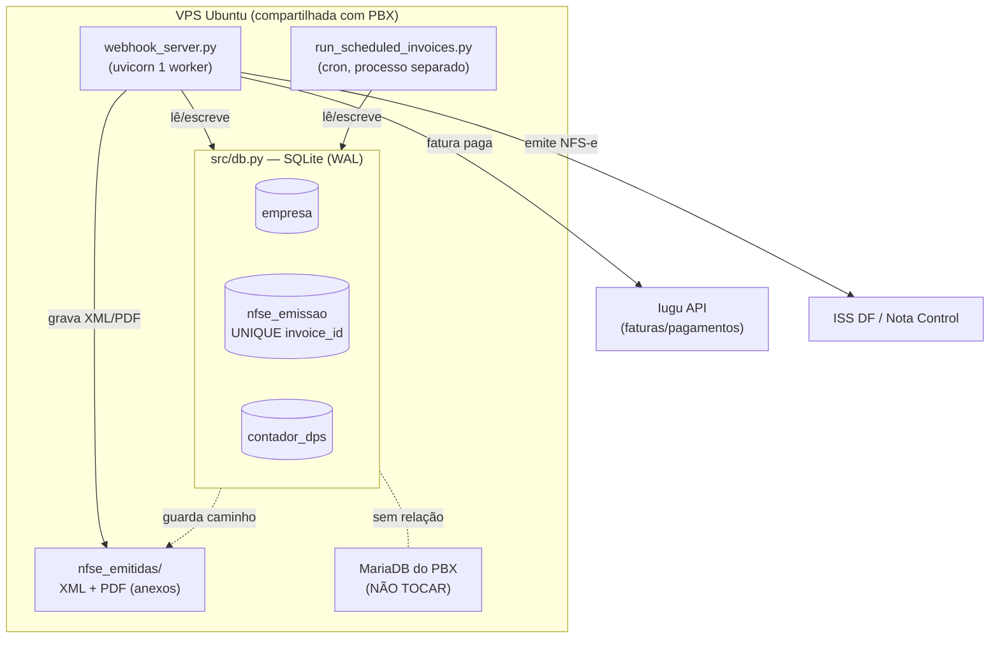

# ADR-0001: Persistência local em SQLite como fonte da verdade do estado fiscal

- Status: Proposto
- Data: 2026-06
- Autor: architecture-designer (squad NTSec)
- Revisores: Bruno Reis (dono do projeto)

## Contexto

Hoje o sistema **não tem banco de dados**. O estado fiscal — a correlação
"fatura X da Iugu → NFS-e número Y" — vive espalhado em arquivos soltos em
`nfse_emitidas/`:

- `dps_<n>_<sufixo>_<timestamp>.xml` (DPS assinada, envelope enviado, retorno);
- `.contador_dps.json` (contador de numeração, protegido por lockfile);
- `*.json` por invoice (logs de emissão) que **o código pressupõe existir, mas
  na prática não são gravados** — `emitir_nfse()` em `src/nfse_df.py` arquiva os
  XMLs, mas nunca grava o `<invoice_id>.json` que `_buscar_nfse_da_fatura`,
  `_carregar_mapa_nfse` e `_verificar_nfse_duplicada` tentam ler.

Consequência: a correlação invoice→NFS-e depende de **heurística de nome de
arquivo** (`if invoice_id[:8] in dps_file.name`, `_extrair_data_do_nome`), o que é
frágil e impreciso. O dashboard conta NFS-e varrendo a pasta e adivinhando datas
a partir de substrings de 8 dígitos no nome do arquivo.

Forças em jogo:

- **Confiabilidade fiscal**: precisamos saber, com certeza, se uma fatura já tem
  NFS-e, qual o número, e qual o status. Erro aqui = nota duplicada ou nota
  faltando (risco fiscal real).
- **Volume baixo**: cliente único (MEGASUPORTE), dezenas de empresas/mês,
  emissões em série única. Não há requisito de throughput ou concorrência alta.
- **VPS compartilhada com PBX Asterisk**: restrição dura — **não adicionar
  serviços pesados** (não subir Postgres/MySQL próprio), não mexer em infra
  (firewall/nginx/upgrade). Já existe um MariaDB de produção na VPS, mas é do
  PBX e **não devemos acoplar nosso schema a ele**.
- **Dois processos concorrentes**: o webhook (`uvicorn`, 1 worker) e o cron de
  boletos (`scripts/run_scheduled_invoices.py`, processo separado) precisam
  compartilhar o mesmo estado com segurança. Hoje compartilham via lockfile só
  para o contador de DPS (Onda 0).
- **Urgência**: a ausência de persistência confiável é a causa-raiz de dois
  outros problemas (idempotência frágil — ADR-0002; e a heurística de duplicata).
  Sem resolver isto primeiro, os outros ADRs não têm onde se apoiar.

## Decisão

Usaremos **SQLite (arquivo único, modo WAL, biblioteca padrão `sqlite3`)** como
**fonte da verdade do estado fiscal e do cadastro de empresas**, porque atende a
consistência transacional que o domínio fiscal exige, não adiciona nenhum
serviço/daemon à VPS compartilhada, e o volume é baixíssimo (escrita serial de
dezenas de registros/mês).

O arquivo do banco fica em `data/iugu_nfse.db` (caminho configurável via
`DB_PATH` no `.env`, com default explícito em `src/config.py`). Acesso encapsulado
em um novo módulo `src/db.py` (conexão + migrations idempotentes no startup).

**A Iugu deixa de ser a fonte da verdade fiscal.** A Iugu continua sendo a fonte
de faturas/pagamentos (é o gateway), mas o **estado de emissão da NFS-e** e o
**cadastro de empresas** passam a viver no SQLite (o desacoplamento do cadastro é
detalhado no ADR-0004, que depende deste).

### Esquema inicial (migration 0001)

```sql
-- Cadastro de empresas (espelha/assume o papel do notes JSON da Iugu — ADR-0004).
-- customer_id é a chave canônica (ADR-0003); cnpj é só índice de busca.
CREATE TABLE empresa (
    customer_id        TEXT PRIMARY KEY,      -- id do customer na Iugu (canônico)
    cnpj               TEXT NOT NULL,
    razao_social       TEXT NOT NULL DEFAULT '',
    email              TEXT NOT NULL DEFAULT '',
    codigo_servico     TEXT NOT NULL DEFAULT '',
    descricao_servico  TEXT NOT NULL DEFAULT '',
    aliquota_iss       REAL NOT NULL DEFAULT 0,
    emitir_nf          INTEGER NOT NULL DEFAULT 1,   -- bool
    nf_na_criacao      INTEGER NOT NULL DEFAULT 0,   -- bool
    descricao_boleto   TEXT NOT NULL DEFAULT '',
    valor_fatura       TEXT NOT NULL DEFAULT '',     -- formato BR "1850,00"
    dia_criacao_fatura INTEGER NOT NULL DEFAULT 0,
    observacoes        TEXT NOT NULL DEFAULT '',
    ativo              INTEGER NOT NULL DEFAULT 1,
    -- endereço
    zip_code TEXT DEFAULT '', street TEXT DEFAULT '', number TEXT DEFAULT '',
    city TEXT DEFAULT '', state TEXT DEFAULT '', district TEXT DEFAULT '',
    complement TEXT DEFAULT '',
    atualizado_em      TEXT NOT NULL DEFAULT (datetime('now'))
);
CREATE INDEX idx_empresa_cnpj ON empresa(cnpj);

-- Estado de emissão fiscal — uma linha por fatura.
-- invoice_id UNIQUE é o coração da idempotência (ADR-0002).
CREATE TABLE nfse_emissao (
    invoice_id        TEXT NOT NULL UNIQUE,   -- id da fatura Iugu
    customer_id       TEXT,                   -- customer canônico que originou (ADR-0003)
    cnpj              TEXT,
    status            TEXT NOT NULL,          -- emitindo|emitida|rejeitada|erro (ADR-0002)
    numero_nfse       TEXT,
    codigo_verificacao TEXT,
    numero_dps        INTEGER,                -- número da DPS usado
    valor_cents       INTEGER,
    competencia       TEXT,                   -- "2026-06"
    ambiente          TEXT,                   -- homologacao|producao
    mensagens         TEXT,                   -- JSON com mensagens do ISS
    xml_enviado_path  TEXT,                   -- anexo em disco (mantém XMLs)
    xml_retorno_path  TEXT,
    pdf_path          TEXT,
    criado_em         TEXT NOT NULL DEFAULT (datetime('now')),
    atualizado_em     TEXT NOT NULL DEFAULT (datetime('now'))
);
CREATE INDEX idx_nfse_customer ON nfse_emissao(customer_id);
CREATE INDEX idx_nfse_cnpj_comp ON nfse_emissao(cnpj, competencia);

-- Contador de numeração de DPS (substitui .contador_dps.json + lockfile).
-- Tabela de 1 linha; o incremento atômico vira UPDATE ... RETURNING dentro de transação.
CREATE TABLE contador_dps (
    id            INTEGER PRIMARY KEY CHECK (id = 1),
    ultimo_numero INTEGER NOT NULL DEFAULT 0
);
INSERT INTO contador_dps (id, ultimo_numero) VALUES (1, 0);

-- Versionamento de schema (migrations idempotentes).
CREATE TABLE schema_version (versao INTEGER PRIMARY KEY, aplicada_em TEXT);
```

> **Os XMLs continuam em disco** (`nfse_emitidas/`). O banco guarda o *caminho*
> dos anexos, não o blob — XML/PDF são arquivos grandes e já têm valor como
> arquivo morto auditável; o SQLite vira o índice confiável sobre eles.

### Concorrência webhook + cron (WAL)

- Abrir o banco em **modo WAL** (`PRAGMA journal_mode=WAL`) no startup: permite
  um escritor e múltiplos leitores simultâneos sem bloqueio total do arquivo.
- `PRAGMA busy_timeout=5000` para que um escritor que pegue o lock de escrita
  espere até 5 s em vez de falhar imediatamente (`SQLITE_BUSY`).
- `PRAGMA synchronous=NORMAL` (seguro com WAL e suficiente para o volume).
- Escritas curtas e em transação explícita (`BEGIN IMMEDIATE`) para o
  incremento do contador e para o `INSERT` de emissão.
- Como só há **1 webhook (uvicorn 1 worker)** + **1 cron episódico**, a chance de
  colisão é mínima; o WAL + busy_timeout cobre o caso raro de sobreposição.
- O lockfile do contador (Onda 0) é **aposentado** — a atomicidade passa a ser
  garantida pela transação SQLite (`UPDATE contador_dps SET ultimo_numero =
  ultimo_numero + 1 ... RETURNING ultimo_numero` dentro de `BEGIN IMMEDIATE`).

## Alternativas Consideradas

| # | Opção | Descrição | Prós | Contras | Esforço |
|---|-------|-----------|------|---------|---------|
| 1 | **SQLite (escolhida)** | Arquivo único + WAL, via `sqlite3` da stdlib | Zero serviço novo na VPS; ACID; stdlib (sem dep); backup = copiar 1 arquivo; suficiente para o volume | Escala horizontal nula (irrelevante aqui); 1 escritor por vez | Médio |
| 2 | PostgreSQL próprio | Subir um Postgres na VPS | Robusto, multi-escritor | **Viola a restrição da VPS** (serviço pesado, RAM, daemon); overkill para dezenas de regs/mês; mais superfície de ataque | Alto |
| 3 | Reusar o MariaDB do PBX | Criar um schema nosso no MariaDB existente | Sem novo daemon | Acopla nosso fiscal ao banco de produção do PBX (blast radius); risco operacional alto; o time do PBX não espera nosso schema lá | Médio |
| 4 | Manter arquivos + índice JSON | Formalizar o `<invoice_id>.json` que falta | Mínima mudança | Não é atômico (TOCTOU persiste — ADR-0002 fica sem base); varredura de pasta não escala nem é transacional; sem UNIQUE | Baixo |
| 5 | TinyDB / dataset | Wrapper "leve" sobre arquivo | API simples | Dependência extra sem ACID real; sem garantias de unicidade atômica | Baixo |

## Diagrama



## Consequências

### Positivas
- Correlação invoice→NFS-e passa a ser **uma query** (`SELECT ... WHERE
  invoice_id = ?`), não heurística de nome de arquivo.
- Habilita a idempotência forte do ADR-0002 (`UNIQUE(invoice_id)` + transação).
- Dashboard e listagens param de varrer pasta e adivinhar datas → mais rápidos e
  corretos.
- Backup trivial: `cp data/iugu_nfse.db data/iugu_nfse.db.bak` (ou `.backup` do
  CLI sqlite, seguro com WAL).
- Sem novo daemon → respeita a restrição da VPS compartilhada.

### Negativas
- Surge um novo artefato de estado a versionar/backupar (mitigado: 1 arquivo).
- WAL cria arquivos auxiliares (`-wal`, `-shm`) que precisam estar no mesmo
  diretório com permissão de escrita pelo usuário do serviço.
- 1 escritor por vez — irrelevante no volume atual, mas é um teto conhecido.
- Migração inicial precisa de cuidado (script de backfill, abaixo).

### Neutras
- O cadastro de empresas migra para o banco (detalhe no ADR-0004); a Iugu vira
  espelho/integração, não fonte fiscal.

## Plano de migração / rollout (incremental, com rollback)

**Princípio: leitura com fallback.** Em cada etapa, o código lê do banco e, se não
achar, cai na fonte atual (arquivos/Iugu). Só removemos o fallback quando o banco
estiver comprovadamente populado.

1. **Etapa 0 — infra (sem mudança de comportamento):**
   - Criar `src/db.py`: abre conexão, aplica `PRAGMA` (WAL, busy_timeout), roda
     migrations idempotentes no import/startup. Adicionar `DB_PATH` em
     `src/config.py` com default `data/iugu_nfse.db`.
   - Adicionar `data/` ao `.gitignore` (não commitar o banco).
   - *Rollback:* remover o import de `db` — nada mais depende dele ainda.

2. **Etapa 1 — backfill (script idempotente `scripts/migrate_to_sqlite.py`):**
   - Varre `nfse_emitidas/`: para cada conjunto `dps_<n>_*`, extrai número da
     DPS, timestamp, e tenta recuperar `numero_nfse`/`codigo_verificacao`
     parseando o `*_retorno_*.xml` (reusa `_parsear_resposta` de `nfse_df.py`).
     Insere em `nfse_emissao` com `status='emitida'` (ou `'rejeitada'` se o
     retorno tiver mensagens de erro). Onde houver `<invoice_id>.json`, usa-o.
   - Define o `contador_dps.ultimo_numero` = max(número de DPS encontrado,
     valor atual de `.contador_dps.json`).
   - Lê os customers da Iugu (`get_repo()`/`notes` JSON) e popula `empresa`
     (base para ADR-0004).
   - **Idempotente:** rodar duas vezes não duplica (usa `INSERT OR IGNORE` por
     `invoice_id`/`customer_id`).
   - *Rollback:* apagar `data/iugu_nfse.db` e rodar de novo — sem efeito colateral
     na Iugu nem nos XMLs.

3. **Etapa 2 — leitura do banco com fallback:**
   - `_buscar_nfse_da_fatura`, `_carregar_mapa_nfse`, dashboard: passam a
     consultar `nfse_emissao` primeiro; se vazio, mantêm a varredura de pasta.
   - *Rollback:* feature flag `DB_READS_ENABLED` (default ligável) → desligar volta
     a ler só de arquivo.

4. **Etapa 3 — escrita no banco:**
   - `emitir_nfse()` grava/atualiza a linha em `nfse_emissao` (status + número +
     caminhos dos XMLs). Contador de DPS passa a usar a tabela (aposenta
     lockfile).
   - *Rollback:* a escrita é aditiva; desligar a flag de leitura volta o
     comportamento antigo mesmo com o banco populado.

5. **Etapa 4 — remover heurística:**
   - Após N dias com banco e arquivo concordando (validar com uma query de
     reconciliação), remover a varredura de pasta e o fallback. Mantém os XMLs em
     disco como anexo.

6. **Validação de corte:** script de reconciliação que compara "NFS-e segundo o
   banco" vs "NFS-e segundo os arquivos" e aponta divergências antes de remover o
   fallback.

## Riscos e mitigações

| Risco | Mitigação |
|-------|-----------|
| Backfill correlaciona DPS→invoice errado (heurística de nome ruim) | Onde não houver `<invoice_id>.json`, marcar a linha com `invoice_id` nulo/sintético e `status='emitida'` mas sinalizada para revisão manual; não inventar correlação. Relatório do script lista os "órfãos". |
| Corrupção do arquivo SQLite | WAL + `synchronous=NORMAL`; backup diário (cópia do arquivo via cron já existente); `PRAGMA integrity_check` no startup. |
| `SQLITE_BUSY` em sobreposição webhook×cron | `busy_timeout=5000`; transações curtas; volume torna a colisão rara. |
| Permissão de escrita do `-wal`/`-shm` na VPS | Garantir que o usuário do systemd tenha escrita no diretório `data/`; documentar no `deploy_vps.md`. |
| `.db` commitado por engano | `.gitignore` em `data/` + checagem no review. |

## Impacto em arquivos/módulos

- **Novo** `src/db.py` — conexão, PRAGMAs, migrations.
- **Novo** `scripts/migrate_to_sqlite.py` — backfill idempotente.
- **Novo** `scripts/reconciliar_nfse.py` — validação de corte.
- `src/config.py` — `DB_PATH` (Field + default explícito).
- `src/nfse_df.py` — `_proximo_numero_dps()` passa a usar a tabela; `emitir_nfse()`
  grava a linha de `nfse_emissao`; aposenta `.contador_dps.json`/lockfile.
- `src/webhook_server.py` — `_verificar_nfse_duplicada` reescrito sobre o banco
  (ver ADR-0002).
- `src/api_routes.py` — `_buscar_nfse_da_fatura`, `_carregar_mapa_nfse`,
  `_contar_nfse_periodo`/dashboard passam a ler do banco.
- `src/iugu_empresas.py` — repositório passa a ler/escrever `empresa` no banco
  (ADR-0004).
- `.gitignore` — incluir `data/`.
- `docs/deploy_vps.md` — passo de criação do diretório `data/` e permissões.

## Trade-offs

**Priorizamos:** consistência fiscal, simplicidade operacional (zero serviço novo),
backup trivial, base para idempotência forte.
**Abrimos mão de:** escala horizontal e multi-escritor (irrelevantes no volume e
na arquitetura de 1 worker).
