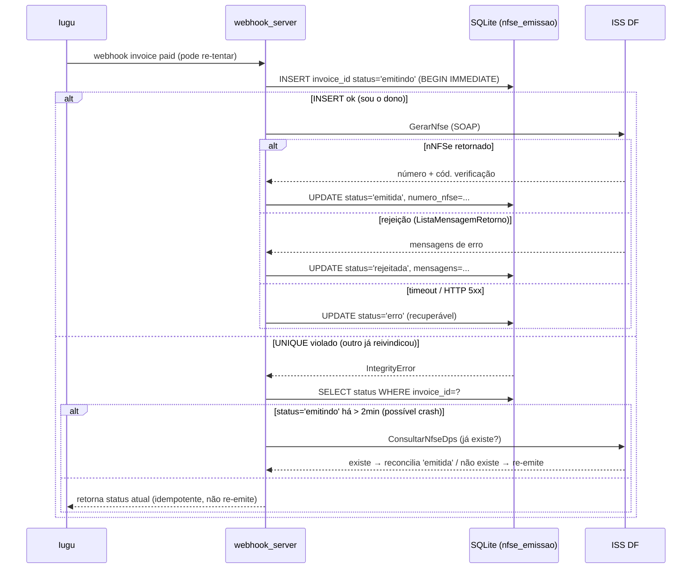

# ADR-0002: Idempotência da emissão de NFS-e por UNIQUE(invoice_id)

- Status: Proposto
- Data: 2026-06
- Autor: architecture-designer (squad NTSec)
- Revisores: Bruno Reis (dono do projeto)

## Contexto

O guardrail anti-duplicata atual (`_verificar_nfse_duplicada` em
`src/webhook_server.py`) usa **5 heurísticas** para decidir se uma fatura já tem
NFS-e:

1. log local por `invoice_id` (`nfse_emitidas/*.json` — que **não é gravado** hoje,
   ver ADR-0001);
2. arquivo DPS cujo nome contém `invoice_id[:8]`;
3. empresa com `nf_na_criacao=True`;
4. custom variable `nfse_emitida_na_criacao` na fatura;
5. **"mesmo CNPJ + mesmo mês + mesmo valor"** nos logs locais.

Dois problemas graves:

- **Falso bloqueio (regra 5):** duas faturas legítimas do mesmo cliente, no mesmo
  mês, com o mesmo valor (ex.: dois departamentos da ALMERIA com a mesma
  mensalidade — ver ADR-0003) são tratadas como duplicata e **uma NFS-e
  legítima deixa de ser emitida**. Risco fiscal silencioso.
- **Não é atômica (TOCTOU):** o webhook é `async` e o check
  (`_verificar_nfse_duplicada`) e a emissão (`emitir_nfse`) são passos separados,
  sem nada que impeça duas execuções concorrentes do mesmo `invoice_id`
  (re-tentativa da Iugu + reprocesso manual via `/processar/{id}`, ou dois
  webhooks da Iugu) de passarem **ambas** pelo check e **ambas** emitirem.
  Resultado possível: **NFS-e duplicada** (a Iugu re-tenta webhooks que demoram,
  e `emitir_nfse` chega a levar dezenas de segundos no SOAP).

Forças:

- A NFS-e é **irreversível na prática** (cancelar exige operação fiscal); duplicar
  é o pior cenário. Falso bloqueio é o segundo pior (nota faltando).
- O ADR-0001 introduz SQLite com `UNIQUE(invoice_id)` — a base atômica que falta.
- Há um caso de borda crítico: **crash entre "o ISS aprovou a NFS-e" e "gravamos
  o sucesso"**. Se simplesmente re-tentarmos, emitimos a nota duas vezes.

## Decisão

Usaremos **`UNIQUE(invoice_id)` na tabela `nfse_emissao` (ADR-0001) como trava de
idempotência atômica**, substituindo as heurísticas. O padrão é
**claim-before-work**:

1. Antes de chamar o SOAP, fazer `INSERT INTO nfse_emissao (invoice_id, status,
   ...) VALUES (?, 'emitindo', ...)` numa transação.
2. **Se o INSERT viola o UNIQUE** → outra execução já reivindicou (ou já concluiu)
   esta fatura. Esta execução **não emite**; lê a linha existente e retorna o
   status atual (idempotente — re-tentativa devolve o mesmo resultado).
3. Se o INSERT vingou, esta execução é a "dona": chama o SOAP, e ao final faz
   `UPDATE` para `'emitida'` / `'rejeitada'` / `'erro'`.

A regra **"CNPJ + mês + valor" deixa de ser bloqueio** e vira apenas **alerta**
(log/flag no retorno), nunca impedindo emissão.

### Ciclo de status

```
            INSERT 'emitindo'
                  │
        chama SOAP (GerarNfse)
                  │
     ┌────────────┼─────────────────────┐
     ▼            ▼                       ▼
 nNFSe presente   ListaMensagemRetorno   exceção/timeout/HTTP 5xx
 = 'emitida'      (rejeição) = 'rejeitada'  = 'erro'
```

- **`emitindo`**: reivindicada, SOAP em andamento (ou processo morreu no meio).
- **`emitida`**: ISS retornou `nNFSe` (sucesso). Terminal.
- **`rejeitada`**: ISS respondeu com mensagens de erro, sem número (ex.: schema,
  IM não liberada). Terminal — **re-tentar não resolve** (alinhado com WEB-011 já
  no código). Permite re-emissão manual após correção cadastral.
- **`erro`**: falha transitória (timeout, HTTP 5xx, exceção de rede). **Recuperável**
  — pode ser re-tentada (a Iugu re-tenta o webhook; `_STAGES_RECUPERAVEIS`).

### Tratamento do crash entre "ISS aprovou" e "gravou" (consulta antes de re-emitir)

Se uma linha ficar presa em **`emitindo`** (o processo morreu depois de mandar o
SOAP, antes do `UPDATE`), **não podemos cegamente re-emitir** — o ISS pode já ter
gerado a nota. Antes de re-emitir uma fatura cujo registro está `'emitindo'` há
mais que um limiar (ex.: 2 min), o sistema **consulta a NFS-e no ISS** pela DPS já
enviada (operação `ConsultarNfseDps` do Manual v1.01, usando o `dps_id`/`numero_dps`
que já gravamos na linha) e:

- se a NFS-e **existe** no ISS → grava `'emitida'` com o número retornado (reconcilia,
  não re-emite);
- se **não existe** → seguro re-emitir (volta a linha para `'emitindo'` com novo
  número de DPS e refaz o SOAP).

Isso fecha a janela de duplicação no crash. O número de DPS é reservado **antes**
do SOAP (ADR-0001), então a consulta tem como localizar a tentativa anterior.

### Convivência com o guardrail atual durante a transição

- Fase de transição: o claim-before-work (banco) roda **primeiro**; só se a fatura
  for reivindicada com sucesso é que `_verificar_nfse_duplicada` é consultado — e
  apenas a regra 5 ("CNPJ+mês+valor") é rebaixada para alerta, as demais (3 e 4 —
  `nf_na_criacao` e custom var) continuam barrando, porque representam emissão por
  outro caminho (cron/criação) legítima.
- Quando o banco estiver populado (ADR-0001 etapa 4), as heurísticas 1, 2 e 5 são
  removidas; 3 e 4 permanecem como "esta fatura foi emitida pelo fluxo de criação".

## Alternativas Consideradas

| # | Opção | Descrição | Prós | Contras | Esforço |
|---|-------|-----------|------|---------|---------|
| 1 | **UNIQUE(invoice_id) + claim-before-work (escolhida)** | INSERT 'emitindo' antes do SOAP; violação de unique = já cuidado | Atômico (DB garante); idempotente por construção; fim do falso bloqueio; consulta-antes-de-reemitir fecha o crash | Exige o banco (ADR-0001); precisa tratar 'emitindo' órfão | Médio |
| 2 | Lock em memória (asyncio.Lock por invoice_id) | Trava no processo do webhook | Simples | **Não cobre o cron (outro processo)** nem múltiplos workers; some no restart; não resolve crash | Baixo |
| 3 | Lockfile por invoice_id (como o do contador) | Arquivo de lock por fatura | Entre processos | Não dá status persistente; lixo de arquivos; não trata "ISS aprovou mas crashou"; reinventa o que o UNIQUE já dá | Médio |
| 4 | Idempotência só na Iugu (custom var) | Marcar a fatura na Iugu antes de emitir | Sem banco | Round-trip à Iugu no caminho crítico; a própria Iugu não garante atomicidade do nosso lado; já é o que falha hoje | Médio |
| 5 | Manter heurísticas, só remover a regra 5 | Patch mínimo | Baixo esforço | Continua **não atômico** (TOCTOU) → duplicação ainda possível | Baixo |

## Diagrama



## Consequências

### Positivas
- **Fim da NFS-e duplicada por concorrência** — a unicidade é garantida pelo banco,
  não por timing.
- **Fim do falso bloqueio** de faturas legítimas com mesmo CNPJ/mês/valor.
- Status fiscal explícito e auditável (`emitindo`/`emitida`/`rejeitada`/`erro`)
  alimenta dashboard e reprocessamento.
- Re-tentativa do webhook da Iugu vira segura e idempotente.

### Negativas
- Linhas presas em `'emitindo'` exigem rotina de reconciliação (consulta ao ISS) —
  complexidade nova, mas necessária para correção.
- Depende da operação `ConsultarNfseDps` estar disponível no provedor (Nota
  Control). Se indisponível em homologação, a reconciliação fica manual até
  produção.

### Neutras
- A regra "CNPJ+mês+valor" não some: vira alerta (útil para o operador notar
  cobranças repetidas), só perde o poder de bloquear.

## Plano de migração / rollout (incremental, com rollback)

1. **Pré-requisito:** ADR-0001 etapas 0–3 (banco existe, `nfse_emissao` com
   `UNIQUE(invoice_id)`, escrita ligada).
2. **Etapa 1 — claim em modo "shadow":** o `INSERT 'emitindo'` passa a rodar, mas
   o bloqueio efetivo ainda é o guardrail antigo. Logamos quando o claim teria
   bloqueado/permitido divergente do guardrail. Coleta evidência sem mudar
   comportamento. *Rollback:* desligar flag `IDEMPOTENCIA_DB`.
3. **Etapa 2 — claim autoritativo:** o claim passa a decidir; regra 5 rebaixada a
   alerta. Guardrail antigo (regras 1,2) ainda roda como cinto-e-suspensório.
   *Rollback:* flag volta ao guardrail.
4. **Etapa 3 — reconciliação de órfãos:** job (no startup do webhook e/ou no cron)
   que varre linhas `'emitindo'` antigas e consulta o ISS (`ConsultarNfseDps`).
5. **Etapa 4 — limpeza:** remover heurísticas 1, 2 e 5 do
   `_verificar_nfse_duplicada`; manter 3 e 4 (emissão por criação).

## Riscos e mitigações

| Risco | Mitigação |
|-------|-----------|
| Linha presa em `'emitindo'` bloqueia re-emissão legítima | Job de reconciliação com consulta ao ISS antes de liberar; limiar de tempo (2 min) para considerar órfã. |
| `ConsultarNfseDps` indisponível (homologação / IM não liberada) | Em caso de indisponibilidade, NÃO re-emitir automaticamente: marcar para revisão manual (segurança fiscal > automação). |
| Re-tentativa da Iugu durante SOAP em andamento | Coberto pelo UNIQUE: a segunda execução recebe IntegrityError e retorna o status corrente sem emitir. |
| Flag de transição esquecida ligada/desligada | Documentar no HANDOFF; default seguro = guardrail antigo até validação. |
| Concorrência cron×webhook na mesma fatura | Mesmo mecanismo (UNIQUE) — o cron usa `nf_na_criacao` e também reivindica antes de emitir. |

## Impacto em arquivos/módulos

- `src/webhook_server.py` — `processar_pagamento` faz claim-before-work;
  `_verificar_nfse_duplicada` reescrito (regra 5 → alerta; consulta ao banco).
- `src/nfse_df.py` — `emitir_nfse` grava `'emitindo'` antes do SOAP e o status
  final depois; reserva `numero_dps` antes do envio; nova função
  `_consultar_nfse_por_dps()` (operação `ConsultarNfseDps`) para reconciliação.
- `src/scheduled_invoices.py` — `_emitir_nfse_para_fatura` também reivindica antes
  de emitir (mesma trava).
- **Novo** `scripts/reconciliar_emitindo.py` (ou função chamada no startup) —
  varre `'emitindo'` órfãs.
- `src/db.py` — helper de `INSERT ... ON CONFLICT`/captura de `IntegrityError`.

## Trade-offs

**Priorizamos:** correção fiscal (zero duplicata, zero falso bloqueio) e
atomicidade real.
**Abrimos mão de:** simplicidade do fluxo (ganhamos um ciclo de status e uma
rotina de reconciliação) — custo aceitável dado o risco fiscal.
