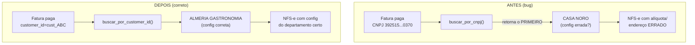
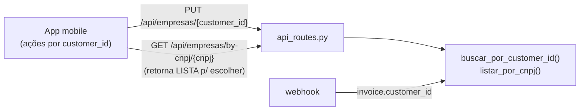

# ADR-0003: customer_id como identificador canônico (multi-cliente por CNPJ)

- Status: Proposto
- Data: 2026-06
- Autor: architecture-designer (squad NTSec)
- Revisores: Bruno Reis (dono do projeto)

## Contexto

O repositório de empresas (`src/iugu_empresas.py`) **indexa por `customer_id`**
(chave única na Iugu) — está correto. O problema é que **os caminhos de escrita e
o webhook ainda roteiam por CNPJ**:

- `buscar_por_cnpj(cnpj)` retorna **"a PRIMEIRA empresa ativa com este CNPJ"**
  (`src/iugu_empresas.py`, linhas ~345-356).
- O **webhook** (`processar_pagamento` em `src/webhook_server.py`) resolve a
  empresa com `repo.buscar_por_cnpj(cnpj)` a partir do CNPJ extraído da fatura.
- As rotas de **escrita** em `src/api_routes.py` operam por CNPJ:
  `/api/faturas` (criar), `GET/PUT/DELETE /api/empresas/{cnpj}`, `reenviar` —
  todas usam `buscar_por_cnpj` / `_buscar_customer_iugu_por_cnpj`.
- O app mobile também age por CNPJ nos pontos de escrita.

**Bug fiscal ativo:** um mesmo CNPJ pode ter **vários customers** na Iugu (regra de
negócio real: a **ALMERIA tem 3** — "CASA NORO", "ALMERIA GASTRONOMIA", etc., todos
sob o CNPJ `39251506000370`). Cada customer tem **alíquota / código de serviço /
endereço / descrição** próprios no `notes`. Como `buscar_por_cnpj` devolve "o
primeiro", a NFS-e de uma fatura pode sair com **a configuração fiscal do
departamento errado** — alíquota errada, código de serviço errado, endereço errado.
Editar/excluir/gerar-fatura por CNPJ tem o mesmo problema: mexe no "primeiro",
não no que o operador quis.

A boa notícia: **a fatura da Iugu carrega `customer_id`**. O `IuguClient` já
expõe `list_invoices(customer_id=...)` e o objeto invoice traz o `customer_id`
do cliente que a originou. Ou seja, o webhook **tem como** resolver o customer
exato — só não está usando.

Forças:

- Correção fiscal: a NFS-e tem que sair com a config do **departamento correto**.
- Não quebrar o painel em produção: o app mobile e o backend precisam ser
  migrados de forma **coordenada** (o painel está em uso).
- CNPJ continua útil para **busca e exibição** (humano pensa em CNPJ), só não pode
  ser chave de roteamento de escrita/emissão.

## Decisão

Adotaremos **`customer_id` como identificador canônico** para toda operação de
escrita e para a emissão de NFS-e:

1. **Webhook resolve pela fatura, não por CNPJ:** `processar_pagamento` passa a
   usar `invoice["customer_id"]` → `repo.buscar_por_customer_id(customer_id)`.
   Só cai para CNPJ como *fallback de diagnóstico* (e, se houver mais de um
   customer no CNPJ, **não emite e alerta** em vez de chutar o primeiro).
2. **Rotas de escrita passam a `/{customer_id}`:**
   `GET/PUT/DELETE /api/empresas/{customer_id}`, e o `POST /api/faturas` recebe
   `customer_id` (não CNPJ). A emissão (`/api/nfse/{invoice_id}/emitir`,
   `/reenviar`) resolve o customer pela fatura.
3. **CNPJ vira busca/exibição:** `GET /api/empresas?cnpj=...` (ou
   `/api/empresas/by-cnpj/{cnpj}`) retorna **uma LISTA** quando houver vários
   customers — nunca "o primeiro". `buscar_por_cnpj` (singular) é **depreciado**
   para escrita; `listar_por_cnpj` (já existe) é o caminho correto.
4. **O app usa `customer_id`** em todas as ações de escrita; exibe CNPJ + nome do
   departamento (razão social) para o humano escolher quando o CNPJ tem vários.

## Alternativas Consideradas

| # | Opção | Descrição | Prós | Contras | Esforço |
|---|-------|-----------|------|---------|---------|
| 1 | **customer_id canônico (escolhida)** | Escrita e emissão por customer_id; CNPJ só busca/exibição | Corrige o bug fiscal na raiz; alinha com a chave real (Iugu indexa por id); webhook resolve pela fatura | Migração coordenada backend↔app; quebra de contrato nas rotas | Médio |
| 2 | Chave composta (CNPJ + sufixo/departamento) | Inventar um identificador de departamento | Legível | Reinventa o que `customer_id` já é; precisa mapear sufixo→customer; frágil | Alto |
| 3 | Desambiguação interativa por CNPJ | Quando CNPJ tem vários, perguntar ao operador | Mantém CNPJ como entrada | Não resolve o **webhook** (automático, sem humano); a fatura paga precisa decidir sozinha | Médio |
| 4 | Só corrigir o webhook, deixar rotas por CNPJ | Patch mínimo no fluxo automático | Menor mudança no app | Editar/excluir/gerar-fatura continuam mexendo no "primeiro" → bug persiste na gestão manual | Baixo |

## Diagrama

## Consequências

### Positivas
- **Corrige o bug fiscal na raiz**: a NFS-e sai sempre com a configuração do
  departamento que de fato originou a fatura.
- Alinha o roteamento com a chave real do sistema (Iugu indexa por id; o banco do
  ADR-0001 usa `customer_id` como PK de `empresa`).
- Elimina a ambiguidade "o primeiro" em editar/excluir/gerar-fatura.

### Negativas
- **Quebra de contrato** nas rotas `/api/empresas/{cnpj}` e no payload de
  `/api/faturas` → exige release coordenado com o app.
- CNPJ deixa de ser suficiente para escrita; o operador precisa escolher o
  departamento quando o CNPJ tem vários (mais um passo de UX no app).

### Neutras
- `buscar_por_cnpj` não é removido de imediato — fica depreciado (com `warning` em
  log) para não quebrar scripts utilitários durante a transição.

## Plano de migração / rollout (incremental, com rollback)

**Coordenação backend↔app é o ponto crítico.** Estratégia: backend aceita **ambos**
por um período; app migra; depois deprecamos CNPJ nas rotas de escrita.

1. **Etapa 1 — corrigir o webhook (sem impacto no app):** `processar_pagamento`
   passa a usar `invoice["customer_id"]` → `buscar_por_customer_id`. Fallback: se
   a fatura não trouxer `customer_id` (faturas antigas), usa `listar_por_cnpj`; se
   vier **mais de uma**, **não emite e alerta** (em vez de chutar). Isto já mata o
   bug fiscal no fluxo automático **sem tocar no app**. *Rollback:* reverter a
   resolução para `buscar_por_cnpj`.
2. **Etapa 2 — backend dual nas rotas:** adicionar rotas novas
   `/api/empresas/{customer_id}` (GET/PUT/DELETE) e `POST /api/faturas` aceitando
   `customer_id`, **mantendo** as rotas `/{cnpj}` antigas funcionando (com warning
   de depreciação). Adicionar `GET /api/empresas/by-cnpj/{cnpj}` retornando lista.
   App **ainda usa as antigas** — nada quebra. *Rollback:* remover rotas novas.
3. **Etapa 3 — app migra:** release do app que usa `customer_id` nas ações de
   escrita e exibe a lista de departamentos quando o CNPJ tem vários. Backend
   inalterado (dual). *Rollback:* app volta à versão anterior (rotas antigas ainda
   existem).
4. **Etapa 4 — depreciar CNPJ na escrita:** após o app atualizado estar em uso
   (verificar telemetria/logs de uso das rotas antigas), fazer as rotas `/{cnpj}`
   de escrita responderem `409/410` com mensagem orientando o uso de
   `customer_id` (ou redirecionar para a lista). CNPJ permanece só em leitura/busca.
5. **Etapa 5 — limpeza:** `buscar_por_cnpj` (singular) removido dos caminhos de
   escrita; mantido apenas onde "qualquer customer do CNPJ serve" (ex.: exibição).

> Para "aceitar ambos" sem duplicar rota: as rotas novas usam `{customer_id}`;
> como `customer_id` da Iugu e CNPJ têm formatos distinguíveis, é possível um
> resolvedor único que detecta o tipo — **porém preferimos rotas explícitas
> separadas** (`/empresas/{customer_id}` vs `/empresas/by-cnpj/{cnpj}`) para evitar
> ambiguidade e deixar a depreciação limpa.

## Riscos e mitigações

| Risco | Mitigação |
|-------|-----------|
| Fatura antiga sem `customer_id` no payload | Fallback `listar_por_cnpj`; se >1, não emite e alerta (operador resolve manual). Confirmar no `IuguClient` que `get_invoice` traz `customer_id`. |
| App e backend fora de sincronia no deploy | Período dual (Etapa 2-3); só deprecar (Etapa 4) após confirmar app atualizado em uso. |
| Operador não sabe qual departamento escolher | App exibe razão social + endereço + alíquota de cada customer do CNPJ na lista. |
| Scripts utilitários quebram (usam `buscar_por_cnpj`) | Manter a função depreciada com warning; migrar scripts num passo separado, sem urgência. |
| `customer_id` ausente em algum customer carregado | `carregar()` já ignora customer sem `customer_id` (linha ~334); garantir invariante no banco (PK NOT NULL — ADR-0001). |

## Impacto em arquivos/módulos

- `src/webhook_server.py` — `processar_pagamento` resolve por
  `invoice["customer_id"]`; guardrail de "CNPJ com vários customers → não emite".
- `src/api_routes.py` — novas rotas `/api/empresas/{customer_id}` (GET/PUT/DELETE)
  e `/api/empresas/by-cnpj/{cnpj}` (lista); `POST /api/faturas` aceita
  `customer_id`; depreciação progressiva das rotas `/{cnpj}` de escrita;
  `/api/nfse/{invoice_id}/reenviar` resolve customer pela fatura.
- `src/iugu_empresas.py` — `buscar_por_customer_id` vira o caminho primário;
  `buscar_por_cnpj` marcado depreciado para escrita; `listar_por_cnpj` exposto na
  API.
- `mobile/src/services/` + `screens/` (Empresas, CadastrarEmpresa, Faturas) —
  ações de escrita por `customer_id`; tela de seleção de departamento quando CNPJ
  tem vários.
- `src/scheduled_invoices.py` — o cron já itera por `Empresa` (que tem
  `customer_id`); garantir que a emissão use o objeto resolvido, não re-busca por
  CNPJ.
- Tabela `nfse_emissao.customer_id` e `empresa.customer_id` (ADR-0001) já preveem
  isto.

## Trade-offs

**Priorizamos:** correção fiscal (NFS-e com a config certa) e alinhamento com a
chave real do domínio.
**Abrimos mão de:** a conveniência de "tudo por CNPJ" (entrada mais simples) e
pagamos o custo de um rollout coordenado backend↔app.
