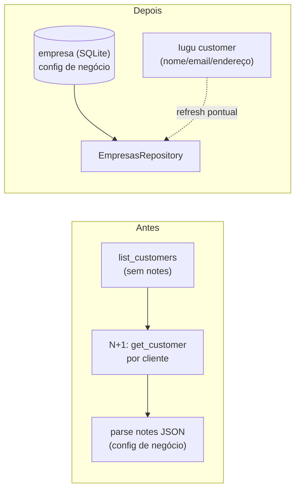

# ADR-0004: Desacoplar a configuração de negócio do campo `notes` da Iugu

- Status: Proposto
- Data: 2026-06
- Autor: architecture-designer (squad NTSec)
- Revisores: Bruno Reis (dono do projeto)

> Este ADR é **consequência do ADR-0001** (persistência SQLite). É curto e
> opcional no curto prazo, mas recomendado para fechar o ciclo de desacoplamento.

## Contexto

Hoje a configuração de negócio de cada empresa (`codigo_servico`, `aliquota_iss`,
`emitir_nf`, `nf_na_criacao`, `descricao_boleto`, `valor_fatura`,
`dia_criacao_fatura`, `ativo`, `observacoes`) vive como **JSON serializado dentro
do campo `notes` de cada customer da Iugu** (`src/iugu_empresas.py`,
`empresa_para_notes_json` / `_parse_notes_json`).

Problemas:

- **N+1 GETs:** `list_customers` **não retorna `notes`**, então `carregar()` faz
  1 `get_customer` por cliente (em `ThreadPoolExecutor`) só para ler a config —
  documentado no próprio código (linhas ~316-319). É caro e frágil.
- **Acoplamento indevido:** dados fiscais nossos viajam num campo de texto livre
  de um sistema de terceiro (a Iugu). Edição manual no painel da Iugu pode
  corromper o JSON; o `notes` não tem schema, validação nem histórico.
- **Sem transação/validação:** o `PUT` faz read-modify-write do JSON (ler `notes`,
  merge, regravar) — sujeito a corrida e a sobrescrever campos.

Com o ADR-0001, passamos a ter um lugar próprio e transacional (`empresa` no
SQLite) para essa config.

## Decisão

Usaremos a tabela **`empresa` (SQLite, ADR-0001) como fonte da verdade da
configuração de negócio**. A Iugu volta a ser apenas o **gateway de
faturas/pagamentos** e o detentor dos **dados nativos do customer** (nome, e-mail,
CNPJ, endereço). O campo `notes` deixa de ser fonte de config — no máximo um
espelho informativo (opcional), nunca lido como verdade.

- **Leitura:** `EmpresasRepository` lê a config de negócio do banco; junta com os
  dados nativos do customer (nome/endereço) — que podem vir do banco (espelhados na
  migração) ou de um refresh pontual da Iugu.
- **Escrita:** cadastrar/editar empresa grava no banco (transação, validação
  Pydantic). Sincronização com a Iugu (criar/atualizar customer nativo) continua,
  mas **não** depende mais de empacotar a config no `notes`.
- **Fim do N+1:** não é mais preciso `get_customer` por cliente para obter config
  — ela está no banco. A Iugu só é consultada para criar/atualizar o customer ou
  para refresh de dados nativos.

## Alternativas Consideradas

| # | Opção | Descrição | Prós | Contras | Esforço |
|---|-------|-----------|------|---------|---------|
| 1 | **Config no SQLite (escolhida)** | `empresa` é a fonte; Iugu = gateway + dados nativos | Fim do N+1; schema/validação/transação; sem acoplar fiscal a campo de 3º | Precisa sincronizar dois lugares (banco × customer nativo da Iugu) | Médio |
| 2 | Manter no `notes` | Status quo | Zero mudança | N+1 persiste; sem schema; corrível a corromper; acoplamento | Baixo |
| 3 | Cache do `notes` em memória só | Já existe (TTL 300s, Onda 0) | Reduz N+1 no curto prazo | Não resolve acoplamento nem validação; cache frio paga o N+1; já é o atual | Baixo |
| 4 | Custom fields estruturados da Iugu | Usar campos próprios da Iugu | Estruturado | Ainda acopla fiscal a 3º; nem todos os campos cabem; vendor lock-in | Alto |

## Diagrama

## Consequências

### Positivas
- Fim do N+1 à Iugu no carregamento de empresas.
- Config fiscal com schema, validação e transação; não corrompível por edição no
  painel da Iugu.
- Base limpa para auditoria/histórico de mudanças de config (coluna
  `atualizado_em` já prevista).

### Negativas
- **Duas fontes a sincronizar:** banco (config + espelho de nativos) × customer
  nativo na Iugu (nome/endereço usados em faturas). Precisa de política clara de
  quem manda em quê.
- Risco de divergência se a config mudar na Iugu por fora (mitigado: `notes` deixa
  de ser lido como verdade).

### Neutras
- A interface pública de `Empresa`/`EmpresasRepository` é mantida (mesma dataclass),
  só muda a origem dos dados — minimiza ripple no resto do código.

## Plano de migração / rollout (incremental, com rollback)

1. **Pré-requisito:** ADR-0001 (tabela `empresa` criada e populada pelo backfill,
   que já lê o `notes`).
2. **Etapa 1 — leitura do banco com fallback ao `notes`:** `carregar()` lê do
   banco; se uma empresa não estiver no banco, cai no fluxo atual (get_customer +
   notes) e a insere no banco. *Rollback:* flag `EMPRESA_DB_SOURCE` → volta ao
   `notes`.
3. **Etapa 2 — escrita no banco:** cadastrar/editar grava no banco; continua
   criando/atualizando o customer nativo na Iugu (nome/email/endereço), mas **para
   de empacotar config no `notes`** (opcionalmente grava um espelho informativo).
4. **Etapa 3 — remover N+1:** `carregar()` deixa de fazer `get_customer` por
   cliente para config (lê tudo do banco); a Iugu só é consultada para dados
   nativos quando necessário.
5. **Etapa 4 — política de sincronização:** definir que **a config é do banco** e
   **os dados nativos (nome/endereço usados na fatura) são do customer Iugu**; um
   job de refresh pontual concilia nativos quando preciso.

## Riscos e mitigações

| Risco | Mitigação |
|-------|-----------|
| Divergência banco × Iugu nos dados nativos | Definir dono por campo (Etapa 4); refresh pontual de nativos; não ler `notes` como verdade. |
| Empresa cadastrada direto na Iugu (sem passar pelo app) não aparece | Fallback da Etapa 1 + job de descoberta que insere no banco customers novos. |
| Migração perde config existente no `notes` | Backfill do ADR-0001 lê o `notes` e popula o banco antes de cortar; reconciliação valida contagem. |

## Impacto em arquivos/módulos

- `src/iugu_empresas.py` — `EmpresasRepository.carregar` lê do banco;
  `empresa_para_notes_json`/`_parse_notes_json` ficam só para
  migração/espelho; fim do N+1.
- `src/api_routes.py` — cadastrar/editar/excluir empresa operam no banco
  (transação) + sincronização de nativos na Iugu (sem config no `notes`).
- `src/db.py` — CRUD da tabela `empresa`.
- `scripts/migrate_to_sqlite.py` (ADR-0001) — já popula `empresa` a partir do
  `notes`.

## Trade-offs

**Priorizamos:** desacoplamento da config fiscal, fim do N+1, validação/transação.
**Abrimos mão de:** a simplicidade de "tudo num só lugar (Iugu)" — passamos a ter
duas fontes com política de sincronização explícita.
