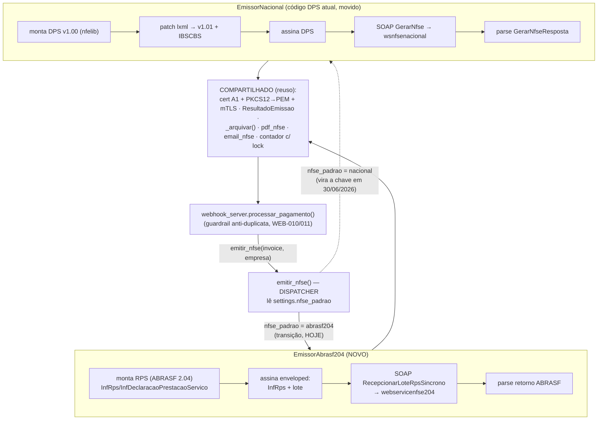

# ADR-0005: Emissão de NFS-e DF via ABRASF 2.04 (RPS) como caminho de produção de transição

## Status

**Proposto** — *condicionado à resposta do Nota Control* (esclarecimento Padrão Nacional vs ABRASF).

- **Data:** 2026-06-05
- **Autor:** architecture-designer (squad NTSec)
- **Revisores:** Bruno Reis
- **Gatilho do bloqueio:** depende da resposta ao e-mail `docs/email_notacontrol_padrao_nacional.md`
  (enviado a `integracao.df@notacontrol.com.br`). Se a resposta for *"pode emitir direto pelo
  Padrão Nacional"*, este ADR é **descartado** (vira `Depreciado`). Se for *"use ABRASF 2.04 até
  30/06/2026"*, este ADR vira o **plano de produção de curto prazo**.

---

## Contexto

### Fato novo (o que mudou)

O Nota Control **habilitou a MEGASUPORTE em produção** e informou que o webservice oficial do DF
para emissão é **ABRASF 2.04** — **não** o Padrão Nacional (DPS). Detalhes confirmados:

| Item | Valor |
|------|-------|
| Endpoint produção | `https://df.issnetonline.com.br/webservicenfse204/nfse.asmx` |
| Endpoint homologação | `https://www.issnetonline.com.br/homologaabrasf/webservicenfse204/nfse.asmx` |
| WSDL produção | `https://df.issnetonline.com.br/webservicenfse204/nfse.asmx?wsdl` |
| Documento fiscal | **RPS** (Recibo Provisório de Serviço), **série 3** |
| Numeração RPS | automática/sequencial — consultada no portal (menu *Solicitação de Documentos Fiscais*) |
| Município | **5300108** (Brasília) |
| Canal de validação de XML | `integracao.df@notacontrol.com.br` |

Isso **confirma o `docs/relatorio-integracao-nfse-df.md`**: o DF manteve o emissor próprio ISSnet/ABRASF.
O comunicado da Seec-DF (30/12/2025) afirma que o DF optou por **manter o emissor próprio ISSnet** e fazer
o "De-Para" dos campos para o Ambiente Nacional de Dados (ADN). O Padrão Nacional (DPS) só se torna
**obrigatório em 30/06/2026** (prazo prorrogado).

### A tensão central

```
ABRASF 2.04  ──── emite HOJE em produção ────► se aposenta em ~30/06/2026
Padrão Nacional (DPS)  ──── JÁ IMPLEMENTADO ───► só vira obrigatório em 30/06/2026 (endpoint deu HTTP 404)
```

- **Hoje:** o único caminho de produção confirmado é o ABRASF 2.04. O endpoint do Padrão Nacional
  (`nfse.issnetonline.com.br/wsnfsenacional/...`) retorna **HTTP 404** para o nosso CNPJ.
- **Investimento atual:** `src/nfse_df.py` está **inteiramente construído para o Padrão Nacional (DPS v1.01)** —
  montagem via `nfelib` + patch v1.00→v1.01 via `lxml`, assinatura A1, envelope SOAP `GerarNfse` ao
  `wsnfsenacional`, parsing de `GerarNfseResposta`. Funciona estruturalmente (XML passa no XSD v1.01);
  o bloqueio era cadastral, não de schema.
- **Risco de retrabalho:** construir o ABRASF 2.04 é **esforço potencialmente descartável** em ~25 dias,
  já que o Padrão Nacional (já pronto) vira obrigatório em 30/06/2026.

### Estado atual do sistema relevante

- `src/nfse_df.py` — `emitir_nfse(invoice, empresa)` é a função pública chamada pelo webhook. Faz HOJE:
  monta DPS → assina A1 → SOAP `GerarNfse` no `wsnfsenacional` → parse → arquiva → gera PDF.
- `src/webhook_server.py` — `processar_pagamento()` (linha ~431) chama `emitir_nfse`; à sua volta há
  guardrail anti-duplicata (`nfse_ja_emitida`, "mesmo CNPJ+mês+valor"), classificação de falha
  recuperável/terminal (WEB-010/011) e disparo de e-mail. **Nada disso é específico do protocolo.**
- `src/config.py` — bloco `NFSE_*`: certificado, prestador, IM/CF-DF, código de serviço, série, IBSCBS.
- `src/email_nfse.py`, `src/pdf_nfse.py` — entrega e DANFSE; agnósticos ao protocolo de emissão.

### Urgência / impacto de não decidir

Sem decisão, a MEGASUPORTE **não emite NFS-e em produção** (o caminho DPS dá 404; o ABRASF não está
implementado). O cliente está habilitado e faturando — cada fatura paga sem NFS-e é uma pendência fiscal.

---

## Decisão

**Usaremos o ABRASF 2.04 (RPS série 3, endpoint `webservicenfse204`) como backend de produção de
transição até 30/06/2026, implementado atrás de uma abstração por protocolo, de modo que a virada
para o Padrão Nacional (DPS) — já implementado — seja uma troca de configuração (`NFSE_PADRAO`),
não uma reescrita.**

Concretamente:

1. Extrair a interface comum de emissão (`EmissorNFSe`) já exercida por `emitir_nfse`.
2. Encapsular o código DPS atual num backend `EmissorNacional` (refator de movimentação, sem mudar lógica).
3. Implementar um novo backend `EmissorAbrasf204` (RPS, ABRASF 2.04, ISSnet DF).
4. Transformar `emitir_nfse` num **dispatcher** que seleciona o backend por `settings.nfse_padrao`.
5. Reaproveitar TODO o resto (webhook, guardrail, assinatura A1, PDF, e-mail, arquivamento).

> **Esta decisão só é executada se o Nota Control confirmar que ABRASF 2.04 é obrigatório até 30/06.**
> Se confirmarem o Padrão Nacional direto, mantém-se o backend `EmissorNacional` e o ABRASF não é construído.

### O que REUSA vs o que é NOVO

| Componente | Reusa? | Observação |
|---|---|---|
| Fluxo do webhook (`processar_pagamento`) | ✅ REUSA | Agnóstico ao protocolo; chama `emitir_nfse` |
| Guardrail anti-duplicata (CNPJ+mês+valor / `nfse_ja_emitida`) | ✅ REUSA | Lógica de negócio, independe do XML |
| Classificação falha recuperável/terminal (WEB-010/011) | ✅ REUSA | Opera sobre o `dict` de resultado |
| Certificado A1 + assinatura XMLDSig (`erpbrasil.assinatura`) | ✅ REUSA¹ | ¹ref/transform podem mudar — ver "Diferenças" |
| Conversão PKCS#12→PEM + mTLS httpx (`_pkcs12_to_pem_tempfiles`) | ✅ REUSA | Mesmo certificado, mesmo transporte |
| Geração de PDF / DANFSE (`pdf_nfse.py`) | ✅ REUSA | Recebe número+código+dados; agnóstico |
| Envio por SMTP (`email_nfse.py`) | ✅ REUSA | Recebe PDF+XML; agnóstico |
| Arquivamento em disco (`_arquivar`) | ✅ REUSA | Mesmo diretório `nfse_emitidas/` |
| `ResultadoEmissao` / contrato de retorno | ✅ REUSA | Interface comum entre backends |
| Lock entre processos do contador | ✅ REUSA (padrão) | Aplicar ao contador de **RPS** (numeração própria) |
| Montagem do XML | ❌ NOVO | **RPS** no schema **ABRASF 2.04**, não DPS v1.01 |
| Estrutura `InfDeclaracaoPrestacaoServico` / `InfRps` | ❌ NOVO | Sem `IBSCBS`, sem patch v1.00→v1.01 |
| Endpoint / WSDL | ❌ NOVO | `webservicenfse204` (ISSnet), não `wsnfsenacional` |
| Operação SOAP | ❌ NOVO | `RecepcionarLoteRpsSincrono` / `GerarNfse` (ABRASF), com envelope ISSnet |
| Assinatura *enveloped* no lote/RPS | ❌ NOVO | Assina `InfRps` e o **lote** (`EnviarLoteRpsEnvio`), 2 referências |
| Parsing da resposta | ❌ NOVO | `ConsultarNfsePorRps`/retorno ABRASF (estrutura diferente) |
| Numeração de RPS série 3 | ❌ NOVO | Faixa solicitada no portal; contador próprio |

---

## Estratégia de coexistência (abstração por protocolo)

Introduzimos um seletor de config e dois backends atrás de uma interface comum. A virada de 30/06
é trocar `NFSE_PADRAO=abrasf204` → `NFSE_PADRAO=nacional` no `.env`.

### Config (em `src/config.py`)

```python
# Seletor de backend de emissão. Troca de produção em 30/06/2026 = mudar este valor.
nfse_padrao: Literal["abrasf204", "nacional"] = Field(
    "abrasf204", description="Protocolo de emissão NFS-e: ABRASF 2.04 (transição) ou Padrão Nacional (DPS)"
)
# URLs ABRASF 2.04 (ISSnet DF)
nfse_abrasf_ws_url_homologacao: str = Field(
    "https://www.issnetonline.com.br/homologaabrasf/webservicenfse204/nfse.asmx", ...
)
nfse_abrasf_ws_url_producao: str = Field(
    "https://df.issnetonline.com.br/webservicenfse204/nfse.asmx", ...
)
nfse_abrasf_serie_rps: str = Field("3", description="Série do RPS no DF (ABRASF 2.04)")
```

### Interface comum

```python
# src/nfse/base.py (novo)
class EmissorNFSe(Protocol):
    async def emitir(self, invoice: dict, empresa: Empresa) -> ResultadoEmissao: ...
```

### Dispatcher (`emitir_nfse` vira seletor)

```python
# src/nfse_df.py — emitir_nfse passa a ser fino
async def emitir_nfse(invoice: dict, empresa: Empresa) -> dict:
    backend = _selecionar_backend(settings.nfse_padrao)   # 'abrasf204' | 'nacional'
    resultado = await backend.emitir(invoice, empresa)
    return resultado.to_dict()

def _selecionar_backend(padrao: str) -> EmissorNFSe:
    if padrao == "abrasf204":
        from .nfse.abrasf204 import EmissorAbrasf204
        return EmissorAbrasf204()
    from .nfse.nacional import EmissorNacional   # código DPS atual, movido
    return EmissorNacional()
```

### Diagrama do dispatcher por protocolo



---

## Alternativas Consideradas

| # | Opção | Descrição | Prós | Contras | Esforço |
|---|-------|-----------|------|---------|---------|
| 1 | **ABRASF 2.04 atrás de abstração** (escolhida) | Implementar backend RPS atrás de `EmissorNFSe`; dispatcher por `NFSE_PADRAO` | Emite HOJE em produção; reusa ~70% do código; virada de 30/06 é troca de config; isola retrabalho num único módulo | Esforço potencialmente descartável; lib ISSnet pouco mantida; prazo curto | **Médio** |
| 2 | Esperar resposta e ir **direto ao Padrão Nacional** | Não construir ABRASF; insistir no `wsnfsenacional` | Zero retrabalho; código já pronto | **Bloqueado por HTTP 404 hoje**; depende de o Nota Control liberar o endpoint nacional para o CNPJ; sem data garantida | Baixo (se liberarem) |
| 3 | ABRASF 2.04 **substituindo** o DPS (sem abstração) | Reescrever `nfse_df.py` para RPS, descartar DPS | Caminho mais curto agora | **Joga fora** o investimento no DPS; em 30/06 reescreve de novo no sentido inverso | Médio |
| 4 | Agregador (**Nuvem Fiscal / Focus NFe**) | Terceirizar a emissão via REST/JSON | Abstrai ABRASF↔Nacional; suporta Brasília 5300108 e CF/DF; webhooks | Custo recorrente; dependência de terceiro; já temos cert A1 + grande parte do fluxo pronto; vendor lock-in | Baixo-Médio |
| 5 | Backend ABRASF **com `akretion/nfselib`** | Usar lib que mapeia Brasília 5300108 ao ISSnet | Reaproveita bindings ABRASF; mesma família da nfelib já usada | LGPL-2.1; renomeada `nfselib-legacy`; aderência ao layout 2.04 do DF a validar | Médio |
| 6 | Backend ABRASF montando **XML à mão (`signxml`+`zeep`)** | Construir o XML RPS manualmente | Controle total do layout; sem dependência dormente; relatório traz exemplo `signxml`/`zeep` | Mais código próprio para manter; reinventa bindings | Médio-Alto |

**Sobre bibliotecas (item 5 vs 6):** recomenda-se **começar avaliando `akretion/nfselib`** (única que mapeia
explicitamente Brasília 5300108 ao provedor ISSnet, mesma família já em uso no projeto), com **fallback para
montagem manual via `signxml`/`zeep`** se a aderência ao layout 2.04 do DF for insuficiente. A
`erpbrasil/nfselib.issnet` é a mais alinhada ao provedor, porém é só geradora/leitora de XML (não faz SOAP) e
está dormente (1 tag v0.1.0). Para a comunicação, `zeep` (SOAP) + `signxml` (assinatura *enveloped*) conforme o
exemplo do `docs/relatorio-integracao-nfse-df.md`. **Decisão final da lib fica para a implementação**, após
validar 1 XML real no canal `integracao.df@notacontrol.com.br`.

---

## Diferenças ABRASF 2.04 vs Padrão Nacional (DPS) que impactam o código

| Aspecto | Padrão Nacional (DPS v1.01) — atual | ABRASF 2.04 (RPS) — novo | Impacto |
|---|---|---|---|
| Documento | DPS (Declaração de Prestação de Serviços) | **RPS** (Recibo Provisório de Serviço), série 3 | Numeração, schema e nomenclatura distintos |
| Reforma Tributária / `IBSCBS` | **Obrigatório** (patch lxml injeta o grupo) | **Não existe** no ABRASF 2.04 | Remover toda a lógica IBSCBS no backend ABRASF; `_montar_ibscbs_element` não se aplica |
| Schema base | nfelib v1.00 + patch lxml → v1.01 | `nfse.xsd` ABRASF 2.04 (sem patch) | Montagem totalmente nova; sem `_patch_xml_para_v101` |
| Estrutura assinada | `<infDPS Id=...>` (1 referência) | `<InfRps Id=...>` **e** lote (`EnviarLoteRpsEnvio`) — **2 referências** | Assinatura *enveloped* em RPS **e** no lote |
| Algoritmos de assinatura | XMLDSig (conforme manual nacional) | XMLDSig *enveloped*, **C14N, RSA-SHA1, SHA1** (ABRASF clássico) | Confirmar algoritmo aceito pelo ISSnet DF |
| Operações SOAP | `GerarNfse` (`wsnfsenacional`) | `RecepcionarLoteRpsSincrono` / `GerarNfse` (`webservicenfse204`) | Novo envelope, novo `SOAPAction`, novo namespace |
| Envelope | `nfseCabecMsg` + `nfseDadosMsg` (já no código) | Mesmo par de parâmetros ISSnet, schema interno diferente | Reaproveita o padrão de envelope, troca o conteúdo |
| Série | `00001` (DPS) | **série 3** (RPS, fixa no DF) | Novo campo `nfse_abrasf_serie_rps` |
| Numeração | contador DPS local | RPS — **faixa solicitada/consultada no portal** | Contador próprio de RPS, dentro da faixa liberada |
| Resposta | `GerarNfseResposta` → `nNFSe`/`cCodVerif` | Retorno ABRASF (`CompNfse`/`Nfse`) + possível assíncrono via `ConsultarNfsePorRps` | Parsing novo; lote: 1 erro invalida o lote inteiro |
| Campos cadastrais | `cTribNac` (6 díg.), `cTribMun`, `cNBS` | **CNAE**, **item/subitem LC 116/2003**, alíquota ISS | Confirmar mapeamento com o Nota Control (item 3 do e-mail) |
| Códigos de erro | mesmos da família ISSnet | **E160** "arquivo em desacordo com XML Schema" recorrente | Mesma classe de erro a diagnosticar |

---

## Plano de migração / rollout

### Fase A — Implementação atrás da abstração (não muda produção)

1. Criar `src/nfse/base.py` com `EmissorNFSe` (Protocol) e mover `ResultadoEmissao`/`DadosServico` para lá.
2. **Refator de movimentação** do código DPS atual para `src/nfse/nacional.py` (`EmissorNacional`) — sem
   alterar lógica; `nfse_df.emitir_nfse` continua funcionando idêntico via dispatcher (`nfse_padrao=nacional`).
3. Implementar `src/nfse/abrasf204.py` (`EmissorAbrasf204`): montagem RPS, assinatura RPS+lote, envelope
   ISSnet, operação `RecepcionarLoteRpsSincrono`, parsing ABRASF, contador de RPS série 3 com lock.
4. Adicionar `nfse_padrao` + URLs/série ABRASF em `config.py` (default `abrasf204` só após validação).

### Fase B — Homologação ABRASF

5. Apontar para homologação: `https://www.issnetonline.com.br/homologaabrasf/webservicenfse204/nfse.asmx`.
6. **Validar 1 XML de RPS** enviando ao canal `integracao.df@notacontrol.com.br` **antes** de transmitir.
   (Dica do relatório: validar a assinatura no validador da Receita antes do ISSnet.)
7. Emitir **1 RPS de teste** em homologação; consultar o recibo; iterar até passar (atenção ao E160).
8. Confirmar com o Nota Control os dados cadastrais (CNAE, alíquota ISS, item LC 116/2003 — item 3 do e-mail).

### Fase C — Produção

9. Solicitar/consultar a **faixa de numeração de RPS** no portal.
10. `NFSE_PADRAO=abrasf204` + URL de produção; emitir **1 RPS real de baixo valor** (padrão R$1,00, com
    `--dry-run` antes) e validar a NFS-e resultante no portal `iss.fazenda.df.gov.br`.
11. Religar o fluxo automático do webhook.

### Fase D — Descontinuação (virar a chave para o Padrão Nacional)

12. Quando o Padrão Nacional for liberado para o CNPJ (ou em 30/06/2026), validar o `EmissorNacional`
    em homologação nacional e emitir 1 DPS real de teste.
13. **Trocar `NFSE_PADRAO=nacional` no `.env`** e reiniciar o serviço. O backend ABRASF permanece no
    código (não removido de imediato) por segurança de rollback.
14. Após estabilização do nacional (≥30 dias), marcar `EmissorAbrasf204` como depreciado.

### Rollback

- **Antes da Fase C:** reverter é apenas `NFSE_PADRAO=nacional` (volta ao comportamento atual, ainda 404
  em produção — mas não regride nada já funcionando).
- **Depois de virar a chave (Fase D):** se o nacional falhar, `NFSE_PADRAO=abrasf204` reverte para o backend
  ABRASF (que permanece no código até a depreciação formal). **Atenção fiscal:** não emitir o **mesmo**
  serviço nos dois padrões — o guardrail anti-duplicata (CNPJ+mês+valor) protege contra isso.

---

## Consequências

### Positivas

- **Destrava a produção HOJE** pelo único caminho confirmado pelo Nota Control.
- **Preserva o investimento no DPS** — o backend nacional vira um módulo, pronto para 30/06.
- **Virada de 30/06 é troca de 1 variável** (`NFSE_PADRAO`), não reescrita; com rollback fácil.
- **Reuso alto** (~70%): webhook, guardrail, assinatura A1, mTLS, PDF, e-mail, arquivamento intactos.
- O ABRASF 2.04 **não tem IBSCBS** — backend mais simples que o DPS atual (sem patch lxml).

### Negativas

- **Esforço potencialmente descartável** em ~25 dias (vida útil curta do ABRASF até 30/06/2026).
- **Libs ISSnet pouco mantidas** (`erpbrasil/nfselib.issnet` dormente; `akretion/nfselib` LGPL/legacy) →
  pode ser preciso montar XML/assinatura à mão e mantê-los internamente.
- **Duas referências de assinatura** (RPS + lote) e algoritmos ABRASF clássicos (RSA-SHA1/SHA1) → ponto
  sensível; E160 é comum por divergência de schema/encoding/assinatura.
- Numeração de RPS depende de **faixa liberada no portal** (passo manual fora do código).

### Neutras

- Adoção do padrão "um backend por protocolo" cria `src/nfse/` como pacote — leve refator de imports.
- Decisão **condicionada**: pode ser inteiramente descartada se o Nota Control liberar o nacional direto.

---

## Trade-offs

**Priorizamos:** entrada em produção imediata + preservação do trabalho no DPS + virada barata em 30/06.
**Abrimos mão de:** evitar 100% o retrabalho (assumimos um módulo de vida curta) e de simplicidade
máxima (mantemos dois backends coexistindo por um período).

---

## Notas de Implementação

- **Não tocar** em `webhook_server.processar_pagamento`, no guardrail anti-duplicata nem em WEB-010/011 —
  são agnósticos ao protocolo e estáveis em produção.
- Reutilizar `_pkcs12_to_pem_tempfiles`, `_arquivar` e o padrão de lock do contador (aplicado ao RPS).
- O contrato de retorno (`ResultadoEmissao.to_dict()`) é a fronteira: ambos os backends devem devolvê-lo
  idêntico para o webhook não perceber diferença.
- **Validar a assinatura** no validador da Receita Federal antes de transmitir ao ISSnet (reduz E160).
- **Pré-requisito bloqueante:** resposta do Nota Control (`docs/email_notacontrol_padrao_nacional.md`).
- Lembrete de segurança (auto-memória): há credenciais expostas pendentes de rotação — não colar token/senha
  no chat ao configurar o `.env` do ABRASF.

## Impacto em arquivos

| Arquivo | Mudança |
|---|---|
| `src/nfse/base.py` | **Novo** — interface `EmissorNFSe`, `ResultadoEmissao`, `DadosServico` |
| `src/nfse/nacional.py` | **Novo (refator de movimentação)** — código DPS atual de `nfse_df.py` |
| `src/nfse/abrasf204.py` | **Novo** — backend RPS ABRASF 2.04 (montagem, assinatura RPS+lote, SOAP, parsing) |
| `src/nfse_df.py` | **Altera** — vira dispatcher fino (`emitir_nfse` seleciona backend) ou shim de import |
| `src/config.py` | **Altera** — `nfse_padrao` + URLs/série ABRASF |
| `src/webhook_server.py` | **Sem mudança** (chama `emitir_nfse` por trás da abstração) |
| `src/pdf_nfse.py`, `src/email_nfse.py` | **Sem mudança** (agnósticos) |
| `.env` / `.env.example` | **Altera** — `NFSE_PADRAO`, `NFSE_ABRASF_*` |
| `docs/fase2_nfse_df.md` | **Atualizar** — registrar coexistência de protocolos |

## Referências

- `docs/relatorio-integracao-nfse-df.md` — provedor ISSnet/ABRASF 2.04, libs, exemplos `signxml`/`zeep`, E160.
- `docs/email_notacontrol_padrao_nacional.md` — esclarecimento pendente (gatilho deste ADR).
- ABRASF 2.04 (ISSnet DF): `https://df.issnetonline.com.br/webservicenfse204/nfse.asmx?wsdl`
- Homologação: `https://www.issnetonline.com.br/homologaabrasf/webservicenfse204/nfse.asmx`
- akretion/nfselib (Brasília 5300108 → ISSnet): https://github.com/akretion/nfselib
- erpbrasil/nfselib.issnet: https://github.com/erpbrasil/nfselib.issnet
- Projeto ACBr — fórum ISSnet ABRASF 2.04 Brasília/DF: https://www.projetoacbr.com.br/forum/topic/70308-nfse-issnet-abrasf-204-brasilia-df/
