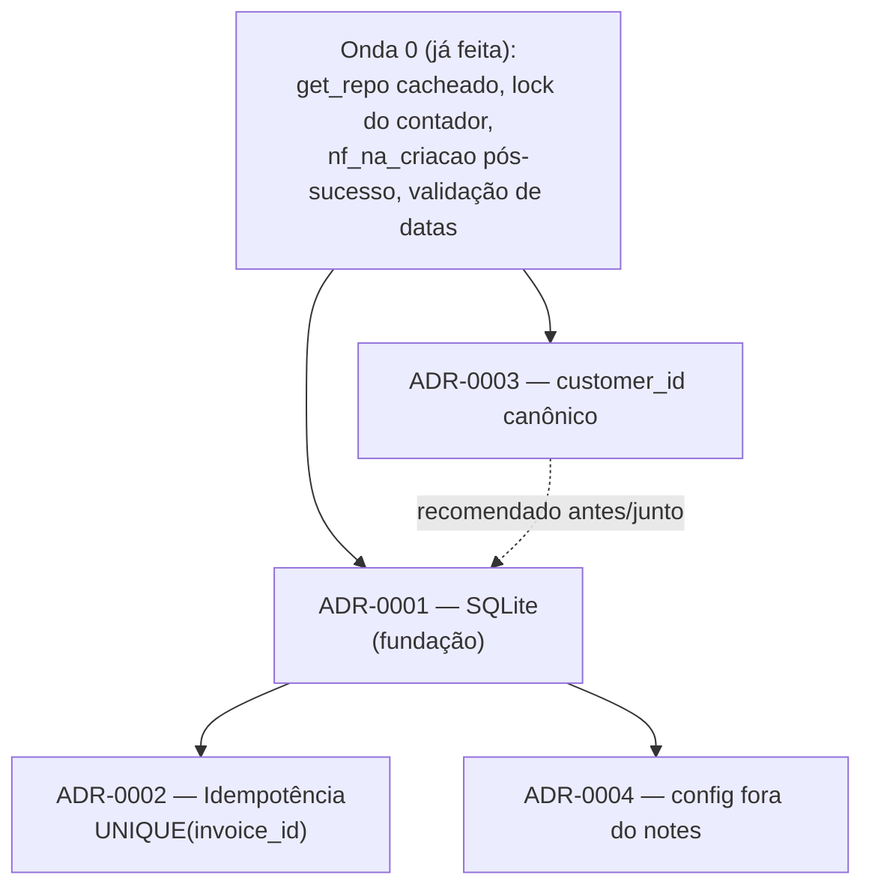

# Architecture Decision Records (ADRs)

Decisões arquiteturais do projeto **Integração Iugu → NFS-e DF**. Cada ADR
documenta uma mudança estrutural com contexto, alternativas, consequências, plano
de migração e impacto. **Status atual: todos `Proposto`** — aguardando aprovação
do dono do projeto (Bruno) antes de qualquer implementação.

## Índice

| ADR | Título | Status | Resolve |
|-----|--------|--------|---------|
| [ADR-0001](ADR-0001-persistencia-sqlite.md) | Persistência local em SQLite como fonte da verdade do estado fiscal | Proposto | Sem persistência; correlação invoice→NFS-e por heurística de nome de arquivo |
| [ADR-0002](ADR-0002-idempotencia-unique-invoice.md) | Idempotência da emissão por `UNIQUE(invoice_id)` | Proposto | Heurística frágil + TOCTOU → risco de NFS-e duplicada e falso bloqueio |
| [ADR-0003](ADR-0003-customer-id-canonico.md) | `customer_id` como identificador canônico (multi-cliente) | Proposto | **Bug fiscal ativo**: roteamento por CNPJ → NFS-e com config do departamento errado |
| [ADR-0004](ADR-0004-config-negocio-desacoplada-do-notes.md) | Desacoplar a config de negócio do campo `notes` da Iugu | Proposto | N+1 GETs à Iugu + config fiscal acoplada a campo de texto de terceiro |

## Ordem de implementação sugerida (com dependências)

### Recomendação de sequência

1. **ADR-0003 (customer_id canônico) — Etapa 1 primeiro, isolada.**
   Corrigir o **webhook** para resolver pela fatura (`invoice.customer_id`) é o
   item de **maior impacto fiscal e menor risco** — não depende do banco nem do
   app. Mata o bug "NFS-e com config errada" no fluxo automático imediatamente.
   *Faça isto antes de tudo.*

2. **ADR-0001 (SQLite) — fundação.**
   É pré-requisito do ADR-0002 e do ADR-0004. Note que o esquema do ADR-0001 já
   usa `customer_id` como chave canônica, então alinha com o ADR-0003. Rollout em
   etapas com leitura-com-fallback.

3. **ADR-0002 (idempotência) — depende do ADR-0001.**
   Só faz sentido depois que `nfse_emissao` com `UNIQUE(invoice_id)` existe e está
   sendo escrita. Fecha o risco de duplicação por concorrência.

4. **ADR-0003 (customer_id) — Etapas 2-5 (rotas + app).**
   A migração das rotas e do app é coordenada e pode acontecer em paralelo ao
   ADR-0002, depois que a Etapa 1 já está em produção.

5. **ADR-0004 (config fora do `notes`) — depende do ADR-0001, por último.**
   Consequência natural de ter o banco; remove o N+1 e o acoplamento. Menor
   urgência (a Onda 0 já mitigou o N+1 com cache).

### Resumo de dependências

- **ADR-0002 → ADR-0001** (precisa da tabela `nfse_emissao` + UNIQUE).
- **ADR-0004 → ADR-0001** (precisa da tabela `empresa`).
- **ADR-0003** é majoritariamente independente; sua **Etapa 1 (webhook)** deve vir
  primeiro de tudo pelo alto impacto fiscal; o esquema do ADR-0001 já assume
  `customer_id` canônico, então os dois se reforçam.

## Convenções

- Numeração sequencial, sem reuso (`ADR-0001`, `ADR-0002`, ...).
- Status: `Proposto` → `Aceito` → (`Depreciado` | `Substituído por ADR-XXXX`).
- Mudança de decisão = **novo** ADR que substitui o anterior (não editar o antigo).
